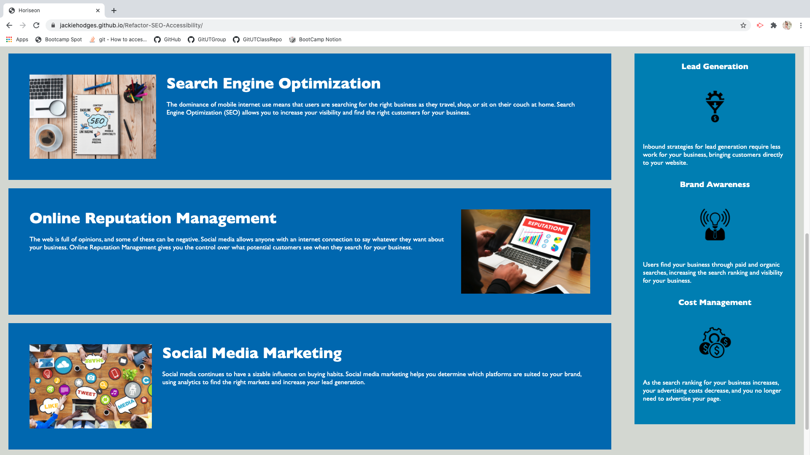
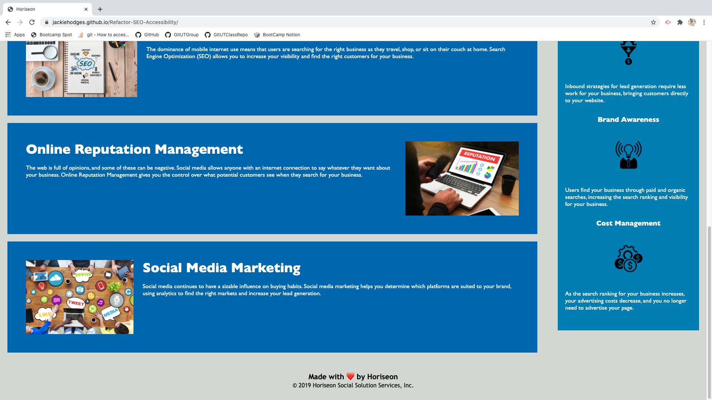

# Refactor-SEO-Accessibility
Refactoring code for SEO and Accessibility

## Description

With the ever increasing demand for Search Engine Optimization and accessibility, I refactored the given code of a mock marketing agency website to meet those needs. This included the following:

* using HTML semantics to define and organize the source code,
* ensuring that styling was organized and exclusive to the CSS file,
* adding alt attributes to images, 
* ensuring headers followed a sequential order, 
* and editing the title element. 

There were changes made in the style file to help consildate reoccuring formats. I also added comments to denote specific sections of the page as well as give a high level description of the changes made.

While the content nor styling of the page changed, the changes mentioned above will ensure that the webpage meets accessibility standards as well as being better utilized in search engines.

## Table of Contents

* [Installation](#installation)
* [Usage](#usage)

## Installation

To install, pull repository and open html file in browser. Repository can be found here: [Refactor SEO Accessibility](https://github.com/JackieHodges/Refactor-SEO-Accessibility)

Otherwise, the github page can be found here: [Refactored Webpage](https://jackiehodges.github.io/Refactor-SEO-Accessibility/)

## Usage

Below are screenshots of the github page:

